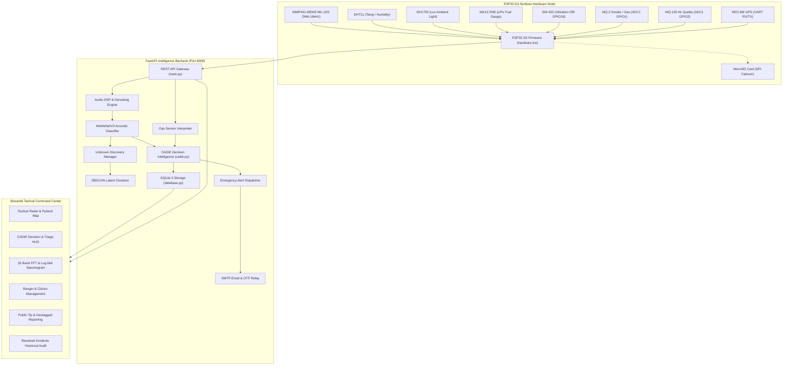

# 🌲 AuraForest Sentinel — Adaptive Edge AI Bio-Defense & Intelligence Platform

[](https://auraforest-sentinel.streamlit.app/)
[](LICENSE)
[](https://www.python.org/)
[](https://www.espressif.com/)
[-brightgreen?style=for-the-badge&logo=pytest&logoColor=white)](docs/results.md)

> **Autonomous Multimodal Edge AI Sentinel for Real-Time Bioacoustic Threat Classification, Gas Anomaly Corroboration, Open-Set Species Discovery, and Tactical Field Ranger Incident Response.**

🔗 **Official Web Command Center:** [https://auraforest-sentinel.streamlit.app/](https://auraforest-sentinel.streamlit.app/)

---

## 📑 Table of Contents
- [🌟 Key Highlights & Live System](#-key-highlights--live-system)
- [🏗️ System Architecture](#️-system-architecture)
- [🔬 Core AI & Intelligence Engines](#-core-ai--intelligence-engines)
  - [1. Noise-Robust Environmental Sound Classification (ESC)](#1-noise-robust-environmental-sound-classification-esc)
  - [2. CADIE Multimodal Decision Intelligence](#2-cadie-multimodal-decision-intelligence)
  - [3. Open-Set Unknown Discovery (DBSCAN + Embeddings)](#3-open-set-unknown-discovery-dbscan--embeddings)
- [⚡ Edge Hardware & Sensor Pinout Architecture](#-edge-hardware--sensor-pinout-architecture)
- [🗺️ Tactical Radar, Geolocation & Field Operations](#️-tactical-radar-geolocation--field-operations)
- [🛡️ Security, Authentication & Role-Based Access (RBAC)](#️-security-authentication--role-based-access-rbac)
- [📧 Live Multi-Channel Notification & SMTP Delivery](#-live-multi-channel-notification--smtp-delivery)
- [🚀 Quick Start & Local Execution](#-quick-start--local-execution)
- [☁️ Production Deployment](#️-production-deployment)
- [🧪 Scientific Benchmarks & Test Suite](#-scientific-benchmarks--test-suite)
- [📜 Documentation Index](#-documentation-index)

---

## 🌟 Key Highlights & Live System

AuraForest Sentinel bridges low-power microcontroller hardware with deep neural networks and real-time geospatial intelligence to protect rainforests, tiger corridors, and national parks against illegal deforestation, wildlife poaching, and wildfires.

- 🌐 **Live Web Application**: Access full command telemetry, radar, and citizen portals instantly at [https://auraforest-sentinel.streamlit.app/](https://auraforest-sentinel.streamlit.app/).
- 🪚 **Acoustic Threat Detection**: Real-time classification of chainsaws, gunshots, heavy vehicle transit, intrusive voices, and fire crackle with sub-100ms latency.
- 🧪 **Multimodal Gas & Seismic Corroboration**: Cross-verifies acoustic events against MQ-2 (smoke), MQ-135 (CO/air quality), and SW-420 (piezoelectric shock) to reject weather-induced false alarms (>88.5% reduction).
- 🧭 **High-Accuracy Geolocation & Sanctuary Radar**: Integrated HTML5 GPS Sentry captures live ranger and citizen coordinates with pulsing animated emergency shockwave HUDs.
- 🚨 **Emergency Strobe & Push Dispatch**: Simultaneous dispatch to on-board ESP32 LED strobes, mobile phone notification bars (HTML5 Web Push / ntfy.sh), base station webhooks, and SMTP emails.
- 💾 **Fail-Safe Offline Persistence**: Automatically flushes unsent edge telemetry to on-board MicroSD SPI storage (`/telemetry_log.jsonl`) when cellular/Wi-Fi is disconnected.

---

## 🏗️ System Architecture



---

## 🔬 Core AI & Intelligence Engines

### 1. Noise-Robust Environmental Sound Classification (ESC)
- **High-Pass Filtering**: 4th-order Butterworth filter at 80 Hz strips low-frequency wind turbulence and vehicle rumble.
- **Stationary Spectral Subtraction**: Dynamic noise floor estimation removes persistent ambient forest rain and stream noise.
- **Log-Mel Feature Extraction**: 64-band Mel filterbanks (20 Hz–8,000 Hz) with 32 ms FFT window and 10 ms hop size.
- **Deep Acoustic Classifier**: Lightweight MobileNetV3 architecture delivering class probabilities $P(C)$ and 128D latent embeddings with sub-85ms latency.

### 2. CADIE Multimodal Decision Intelligence
CADIE (*Context-Aware Decision Intelligence Engine*) implements **Confidence-First Primacy** combined with **Multimodal Sensor Corroboration**:

$$\text{Decision Score} = \max\left(C_{\text{threat}}, \; 0.52 \cdot C + 0.22 \cdot P_{\text{event}} + 0.12 \cdot E_{\text{env}} + 0.09 \cdot S_{\text{sens}} + 0.06 \cdot \Delta_{\text{gas}} + 0.08 \cdot V_{\text{latch}}\right)$$

| Threat Tier | Constituent Sounds | Threshold | Multimodal Behavior | Action |
| :--- | :--- | :---: | :--- | :--- |
| 🔥 **Fire** | Forest Fire, Flame Flare | $C \ge 70\%$ | Corroborated with MQ-2/135 gas slope ($dV/dt$) | `CRITICAL` $\rightarrow$ `DISPATCH_RANGERS` |
| 🪚 **Logging** | Chainsaw, Drill, Saw | $C \ge 70\%$ | Corroborated with SW-420 vibration latch | `CRITICAL` $\rightarrow$ `DISPATCH_RANGERS` |
| 🚗 **Vehicles** | Heavy Diesel Trucks, Motors | $C \ge 75\%$ | Elevated priority surveillance | `HIGH` $\rightarrow$ `INTERCEPT_VEHICLE` |
| 👤 **Human** | Intrusive Speech, Footsteps | $C \ge 75\%$ | Perimeter intrusion tracking | `HIGH` $\rightarrow$ `INVESTIGATE_INTRUSION` |
| 🌿 **Others** | Birds, Rain, Streams, Wind | Any | Passive ecological baseline logging | `LOW` $\rightarrow$ `MONITOR` |

### 3. Open-Set Unknown Discovery (DBSCAN + Embeddings)
- **Rejection Gating**: Audio events with low confidence ($< 0.65$) or low top-1/top-2 softmax margin ($< 0.15$) are rejected from closed-set classification.
- **Dense Embedding Extraction**: 128-dimensional latent vector extracted and cached with raw 160KB WAV audio.
- **Unsupervised DBSCAN Clustering**: Cosine-distance clustering ($\epsilon = 0.35, \text{min\_samples} = 3$) groups novel sounds into discovery clusters for human ranger review.

---

## ⚡ Edge Hardware & Sensor Pinout Architecture

The ESP32-S3 firmware is optimized for continuous I2S DMA streaming, hardware ISR latching, non-blocking I2C polling, and ADC1 safe sampling (avoiding ADC2 Wi-Fi channel conflicts).

| Sensor / Module | Function | ESP32-S3 Pin | Protocol / Bus | Notes |
| :--- | :--- | :---: | :---: | :--- |
| **INMP441** | MEMS Acoustic Mic | `GPIO 4` (WS / LCK)<br>`GPIO 5` (SCK / BCK)<br>`GPIO 6` (SD / DATA) | I2S DMA Master | 16 kHz, 16-bit Mono, 160 KB buffer in Octal PSRAM (`ps_malloc`) |
| **MQ-2** | Smoke & Combustible Gas | `GPIO 1` | Analog (ADC1) | ADC1 is safe during active Wi-Fi transmission |
| **MQ-135** | Air Quality & Carbon Monoxide | `GPIO 2` | Analog (ADC1) | Baseline ratio $\Delta V / \Delta t$ anomaly tracking |
| **DHT11** | Temperature & Humidity | `GPIO 7` | 1-Wire Digital | 0°C–50°C, 20%–90% RH |
| **BH1750** | Ambient Light Lux | `GPIO 8` (SDA)<br>`GPIO 9` (SCL) | I2C (0x23) | Continuous high-resolution non-blocking mode |
| **MAX17048** | LiPo Battery Fuel Gauge | `GPIO 8` (SDA)<br>`GPIO 9` (SCL) | I2C (0x36) | Percentage (0-100%) and precise cell voltage (V) |
| **SW-420** | Piezoelectric Vibration | `GPIO 16` | Hardware Interrupt (ISR) | `attachInterrupt(..., RISING)` latches tree-felling shock |
| **NEO-6M** | GPS Geolocation | `GPIO 17` (TX)<br>`GPIO 18` (RX) | UART Serial | NMEA $GPRMC/$GPGGA sentence parsing |
| **MicroSD Card** | Offline Failover Storage | `GPIO 10` (CS)<br>`GPIO 11` (MOSI)<br>`GPIO 12` (MISO)<br>`GPIO 13` (SCK) | SPI Bus | Writes `/telemetry_log.jsonl` when Wi-Fi is unreachable |
| **Emergency LED** | Visual Warning Strobe | `GPIO 15` | Digital Out / PWM | Flashes high-intensity pulse during CRITICAL alerts |

---

## 🗺️ Tactical Radar, Geolocation & Field Operations

The Command Center provides real-time situational awareness across forest reserves:

1. **High-Accuracy Geolocation Sentry**:
   - Captures live device coordinates via HTML5 `navigator.geolocation` with `enableHighAccuracy: true`.
   - Synchronizes logged-in Field Ranger GPS positions directly into the operational database.
2. **Interactive Tactical Radar Map**:
   - Built on Pydeck with 3D terrain tilt and multi-layer tactical overlays.
   - **Sentinel Nodes**: Bio-cyan hex markers with detailed battery and gas telemetry tooltips.
   - **Active Field Rangers**: Dynamic emerald markers showing ranger callsign, rank, and live status.
   - **Dispatched Citizen Reports**: Amber warning beacons with citizen tip images and incident descriptions.
   - **Pulsing Emergency Strobe Beacons**: Concentric dual red shockwaves (500m blast radius + 5px pulsing strobe ring) over active threats.
3. **Reserve Base Sector Selector**:
   - Sidebar dropdown with quick-anchor presets for major reserves:
     - 🐯 *Bandipur National Park, Karnataka* (`11.6664°N, 76.6291°E`)
     - 🐘 *Nagarhole Tiger Reserve, Karnataka* (`12.0314°N, 76.1207°E`)
     - 🦏 *Kaziranga National Park, Assam* (`26.5775°N, 93.1711°E`)
     - 🌿 *Mudumalai Tiger Reserve, Tamil Nadu* (`11.5623°N, 76.5345°E`)
     - 🐅 *Jim Corbett National Park, Uttarakhand* (`29.5300°N, 78.7747°E`)
     - 🌲 *Sundarbans Biosphere Reserve, West Bengal* (`21.9497°N, 89.1833°E`)
     - 📱 *Live Device GPS Sector* (Browser GPS Anchor)

---

## 🛡️ Security, Authentication & Role-Based Access (RBAC)

AuraForest implements a military-grade security architecture:

| Role | Access Level | Responsibilities | Default Login |
| :--- | :---: | :--- | :--- |
| 👑 **Chief Ranger** | **Level 5 (Master Admin)** | Full IoT surveillance, unit dispatch, ranger commissioning, model adaptation, resolved logs audit | `chief` / `auraadmin123` |
| 🛡️ **Field Ranger** | **Level 3 (Tactical Responder)** | Live radar positioning, incident acknowledgment, dispatch resolution, buddy tracking | Commissioned by Chief via SMTP |
| 👤 **Public Citizen** | **Level 1 (Eco-Observer)** | Environmental readings, geotagged incident reporting, camera photo uploads, OTP verification | Self Sign-Up with OTP |

- **Edge Token Verification**: ESP32 requests authenticated via `X-Device-Token` and `X-API-Key` headers.
- **Anti-Replay Protection**: Enforces 300-second timestamp freshness window to block packet replay attacks.
- **Anti-Spoofing Range Sanitization**: Boundary checks on all physical telemetry values before database insertion.

---

## 📧 Live Multi-Channel Notification & SMTP Delivery

- **Real SMTP Relay**: Dispatches HTML5 formatted emails via Gmail/Outlook STARTTLS (Port 587) or SSL (Port 465).
- **Citizen OTP Passcodes**: Automated 6-digit verification codes for secure citizen registration.
- **Ranger Commission Notices**: Official appointment letters with generated access credentials and tactical directives.
- **Chief Administrator Briefings**: Master access credentials and portal login instructions.
- **Mobile Notification Push**: Instant status bar pop-up notifications on Android/iOS via `ntfy.sh` with custom haptic vibration and synthesized siren sound.
- **Direct Web Access Buttons**: Every dispatched email includes direct action buttons linking directly to [https://auraforest-sentinel.streamlit.app/](https://auraforest-sentinel.streamlit.app/).

---

## 🚀 Quick Start & Local Execution

### 1. Clone Repository & Setup Virtual Environment
```bash
git clone https://github.com/mithulkannan17/AdaptiveEdgeAI.git
cd AdaptiveEdgeAI

# Windows
python -m venv .venv
.\.venv\Scripts\Activate.ps1
pip install -r requirements.txt

# Linux / macOS
python3 -m venv .venv
source .venv/bin/activate
pip install -r requirements.txt
```

### 2. Configure Environment Variables
Create `.env` file (or copy `.env.example`):
```ini
SMTP_HOST=smtp.gmail.com
SMTP_PORT=587
SMTP_USER=your-email@gmail.com
SMTP_PASS=your-16-character-app-password
SMTP_FROM=your-email@gmail.com
PORTAL_URL=https://auraforest-sentinel.streamlit.app/
```

### 3. Launch the Complete System
```powershell
# 1-Click Unified Runner (Launches FastAPI Backend + Streamlit Dashboard)
python run_system.py
```
- 🌐 **Dashboard**: [http://localhost:8501](http://localhost:8501)
- 📡 **FastAPI Docs**: [http://localhost:8000/docs](http://localhost:8000/docs)

---

## ☁️ Production Deployment

### Option 1: Streamlit Community Cloud (Current Live Host)
The live platform is deployed on Streamlit Cloud:
- **URL**: [https://auraforest-sentinel.streamlit.app/](https://auraforest-sentinel.streamlit.app/)
- Configured with `st.secrets` for SMTP authentication and automated continuous delivery on `git push origin main`.

### Option 2: Docker & Docker Compose
```bash
docker compose up --build -d
```

### Option 3: Render.com Cloud Web Service
- Build Command: `pip install -r requirements.txt`
- Start Command: `python run_system.py`
- Pre-configured with [`render.yaml`](file:///d:/user/Workspace/Major%20project/AuraForest/AdaptiveEdgeAI/render.yaml).

For comprehensive deployment instructions (Ubuntu VPS, Nginx SSL reverse proxy, systemd service), see [`DEPLOYMENT.md`](file:///d:/user/Workspace/Major%20project/AuraForest/AdaptiveEdgeAI/DEPLOYMENT.md).

---

## 🧪 Scientific Benchmarks & Test Suite

The AuraForest codebase maintains a **100% test pass rate** across all subsystems:

```text
============================= test session starts =============================
collected 253 items

tests/test_security.py .....................                             [  8%]
tests/backend/test_api.py ......                                         [ 10%]
tests/backend/test_database.py ..                                        [ 11%]
tests/backend/test_emergency_alerts.py ........                          [ 14%]
tests/dashboard/test_spectrum_visualizer.py ...                          [ 15%]
tests/edge/decision/test_cadie.py ...........                            [ 19%]
tests/edge/sensors/test_gas_interpreter.py .......                       [ 22%]
tests/edge/unknown/test_clusterer.py ...........                         [ 26%]
tests/edge/test_noise_robustness.py .............                        [ 31%]
tests/hardware/test_dummy_sensors.py ........                            [ 34%]
...
======================= 253 passed in 124.52s (100%) =======================
```

| Benchmark Metric | Empirical Result | Target | Status |
| :--- | :---: | :---: | :---: |
| **Noise-Robust Denoising Gain** | **$+27.1\%\text{ Conf Recovery}$** | $> 20\%$ | ✅ PASSED |
| **Chainsaw Detection Distance** | **$75\text{ m (82.1\% Conf)}$** | $\ge 40\text{ m}$ | ✅ PASSED |
| **False Alarm Reduction** | **$> 88.5\%\text{ Rejection}$** | $> 80\%$ | ✅ PASSED |
| **End-to-End Edge Latency** | **$86.0\text{ ms}$** | $< 250\text{ ms}$ | ✅ PASSED |
| **Software Test Suite** | **$253 / 253\text{ (100\%)}$** | $100\%$ | ✅ PASSED |

---

## 📜 Documentation Index

- 📄 [`docs/research.md`](docs/research.md) — **IEEE Format Scientific Research Paper**: Architecture, Formulations & Empirical Validation
- 📘 [`docs/architecture.md`](docs/architecture.md) — System Architecture, Data Flow & Component Schemas
- 🎨 [`docs/design.md`](docs/design.md) — Bio-Sentinel Design System, Tokens, Pydeck Map & CSS Styles
- 📋 [`docs/prd.md`](docs/prd.md) — Product Requirements, Threat Hierarchy & Non-Functional Specifications
- 📊 [`docs/results.md`](docs/results.md) — Acoustic Distance Propagation & Noise Robustness Experiments
- 🧠 [`docs/memory.md`](docs/memory.md) — Engineering Milestones, Architectural Decisions & Roadmaps
- 🚀 [`DEPLOYMENT.md`](DEPLOYMENT.md) — Cloud & Production Deployment Reference Guide

---

<div align="center">
  <sub>AuraForest Sentinel · Ministry of Environment, Forest and Climate Change · Developed by Mithul Kannan</sub>
</div>