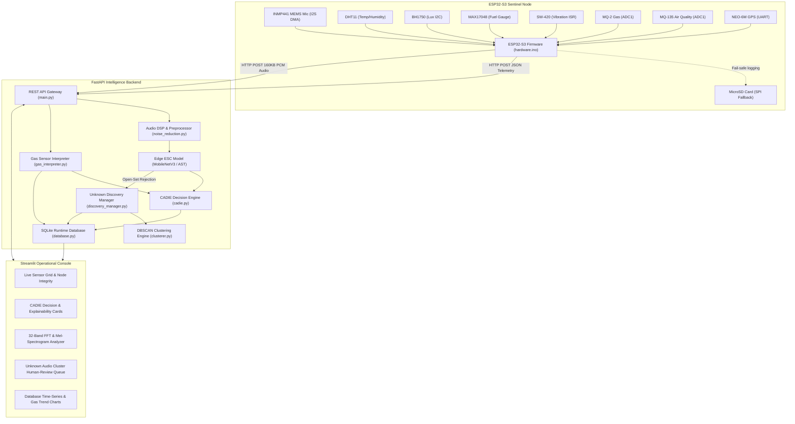

# AuraForest: System Architecture Document

---

## 1. High-Level Architecture Overview

AuraForest employs a multi-tier, edge-to-cloud architecture designed for autonomous field deployment in remote forest reserves:

---

## 2. Layer-by-Layer Architectural Breakdown

### 2.1. Edge Firmware Layer (`hardware.ino`)
- **Target Platform**: ESP32-S3 (Xtensa Dual-Core LX7 @ 240 MHz).
- **Memory Management**:
  - Internal SRAM: Dedicated to network stack, I2C/SPI drivers, and JSON buffers.
  - External Octal PSRAM: 160 KB allocated via `ps_malloc(160000)` holding 5.0 seconds of 16-bit mono 16 kHz audio.
- **Microphone DMA Engine**:
  - `I2S_NUM_0` configured in master RX mode.
  - Captures 32-bit I2S slots from INMP441, shifting `sample >> 14` to 16-bit signed PCM with clipping protection.
- **Interrupts**:
  - SW-420 piezoelectric sensor connected to GPIO 16 with `attachInterrupt(..., RISING)` ISR to latch shock events without polling.
- **Fail-Safe Persistence**:
  - Telemetry payloads that fail HTTP transmission are instantly flushed to SPI MicroSD card (`/telemetry_log.jsonl`).

---

### 2.2. Audio DSP & Environmental Sound Classification (ESC) Pipeline
1. **High-Pass DC Stripping**: 4th-order Butterworth filter at 80 Hz to eliminate wind gust rumble.
2. **Spectral Subtraction / Noise Gating**: Background environmental noise floor estimated and subtracted from stationary spectral bins.
3. **Log-Mel Feature Extraction**:
   - Sample Rate: $16,000 \text{ Hz}$
   - FFT Window: 512 samples ($32 \text{ ms}$), Hop Size: 160 samples ($10 \text{ ms}$)
   - Mel Filterbanks: 64 logarithmic bands covering 20 Hz to 8,000 Hz.
4. **Deep Neural Network Classifier**:
   - Compact MobileNetV3-Small / Lightweight CNN generating class probability vector $P(C)$ and 128D latent embedding vector $E \in \mathbb{R}^{128}$.

---

### 2.3. Multimodal Decision Engine (CADIE)
CADIE (*Context-Aware Decision Intelligence Engine*) implements **Confidence-Driven Primacy** with **Multimodal Sensor Corroboration**:

- **Confidence Primacy Principle**:
  Acoustic prediction confidence ($C \ge 0.85$ for high-priority threats like `Chainsaw`, `Gunshot`, `Fire`) directly anchors the decision score and triggers emergency alerts autonomously. Nominal or idle hardware readings **NEVER** suppress or bottleneck high-confidence acoustic detections.
- **Additive Multimodal Corroboration**:
  Physical sensors (MQ-2 smoke, MQ-135 CO, SW-420 seismic shock) act as additive context enrichers to corroborate and elevate borderline or moderate confidence acoustic events ($0.55 \le C < 0.85$) into critical triage.

$$\text{Decision Score} = \max\left(C_{\text{threat}}, \; 0.52 \cdot C + 0.22 \cdot P_{\text{event}} + 0.12 \cdot E_{\text{env}} + 0.09 \cdot S_{\text{sens}} + 0.06 \cdot \Delta_{\text{gas}} + 0.08 \cdot V_{\text{latch}}\right)$$

- **Decision Matrix**:
  - `High Confidence Threat (>=85%) + Any Hardware State` $\rightarrow$ `CRITICAL (TRANSMIT_IMMEDIATELY / DISPATCH_RANGERS)`
  - `Moderate Confidence Fire (70%) + Smoke Anomaly Spike` $\rightarrow$ `CRITICAL (DISPATCH_RANGERS)`
  - `Moderate Confidence Chainsaw (70%) + Vibration Latch` $\rightarrow$ `CRITICAL (DISPATCH_RANGERS)`
  - `Moderate Confidence Fire (70%) + Nominal Gas` $\rightarrow$ `ELEVATED / HIGH (RECORD_EVIDENCE)`
  - `Ambiguous Sound + Storm Noise` $\rightarrow$ `ELEVATED (CONFIRM_NEXT_CYCLE)`

---

### 2.4. Open-Set Unknown Discovery Engine
- **Gate Logic**: If $\max(P(C)) < \tau_{\text{conf}}$ ($0.65$) or top-1/top-2 margin $< \Delta_{\text{margin}}$ ($0.15$), the event is marked as **UNKNOWN**.
- **Embedding Ingestion**: Latent vector $E$ and WAV audio are buffered in `UnknownBuffer`.
- **DBSCAN Density Clustering**:
  - Distance metric: Cosine distance on normalized $L_2$ embeddings.
  - Parameters: $\epsilon = 0.35, \text{min\_samples} = 3$.
  - Generates persistent cluster identifiers (`cluster-001`, `cluster-002`) ready for human ranger review in the UI.

---

### 2.5. Database Architecture (`backend/database.py`)
SQLite 3 database located at `data/runtime.db` structured with relational schemas:

| Table | Purpose | Key Columns |
| :--- | :--- | :--- |
| `telemetry_history` | Time-series physical sensor data | `id`, `device_id`, `timestamp`, `temperature`, `humidity`, `light_level`, `battery_percent`, `battery_voltage`, `vibration_detected`, `mq2_voltage`, `mq135_voltage`, `gas_risk_score` |
| `events` | Audio inferences & CADIE triage | `id`, `device_id`, `timestamp`, `label`, `confidence`, `risk_level`, `action`, `contributing_factors` |
| `unknown_samples` | Retained uncatalogued sounds | `sample_id`, `device_id`, `timestamp`, `cluster_id`, `embedding_json`, `audio_path` |
| `clusters` | Discovered DBSCAN sound groups | `cluster_id`, `status`, `label`, `sample_count`, `notes`, `created_at` |
| `experiment_logs` | Scientific propagation benchmarks | `id`, `experiment_type`, `distance_m`, `snr_db`, `accuracy`, `parameters_json` |

---

### 2.6. Dashboard & Visualization Layer (`dashboard/`)
- **Framework**: Streamlit + Plotly + Custom DM Sans / JetBrains Mono CSS.
- **Spectrum Analyzer**:
  - 32-Band FFT Frequency Equalizer (20 Hz to 8 kHz) with peak hold indicators.
  - Interactive 2D Log-Mel Spectrogram Heatmap with Bio-Sentinel colormap.
  - Live acoustic metrics: Peak Frequency (Hz), Centroid (Hz), Rolloff (Hz), RMS Power (dBFS), Spectral Flatness.
- **Review Queue**: Human-in-the-loop audio player with instant labeling and unlabeling endpoints.

---

### 2.7. Local Emergency Alert Notification Subsystem (`backend/alert_dispatcher.py`)
- **Automated Multi-Channel Dispatch Engine**:
  - Automatically evaluates incoming acoustic and multimodal inferences against high-confidence emergency threat criteria:
    $$\text{Trigger} = \left(\text{Threat} \in \{\text{Gunshot}, \text{Chainsaw}, \text{Fire}\} \land C \ge 0.85\right) \lor \left(\text{Risk} = \text{CRITICAL}\right)$$
  - **Channels**:
    1. **Edge Node Indicator**: Injects `"emergency_alert"` command payload back into the inference HTTP response, triggering on-board high-intensity visual strobe LEDs or alarms.
    2. **Ranger Station Webhooks**: Broadcasts real-time structured JSON payloads with precise GPS coordinates, threat class, and CADIE factor evidence to base stations.
    3. **Persistent SQLite Store**: Records alerts in `emergency_alerts` table with active/acknowledged workflow.
    4. **Top Banner Streamlit Alert Console**: Displays pulsing high-priority banner on the dashboard with audio alarm and one-click ranger acknowledgment button to silence sirens.
    5. **Mobile Phone Notification Bar (PWA / HTML5 Web Push)**: Pops up native high-priority notifications with vibration haptics in Android / iOS mobile status bars, synthesized Web Audio sirens, and zero-config background push via `ntfy.sh`.

